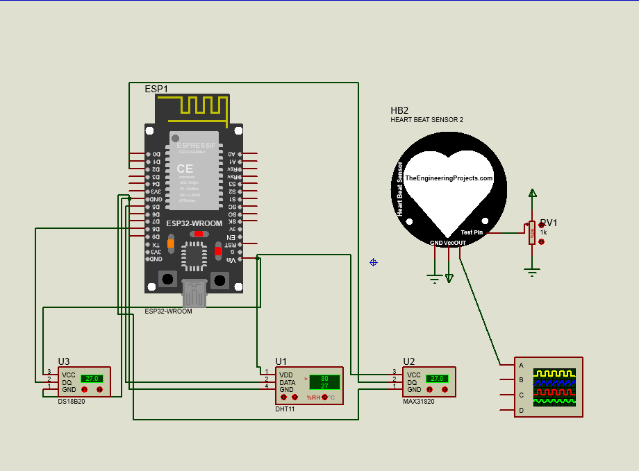

# Medicare

## Getting Started

To get started with the Medicare Health Monitoring System, follow these steps:

1. Clone the repository: `git clone https://github.com/klibiadam/Medicare-ENIT.git`
2. Navigate to the project directory: `cd medicare`
3. Follow specific instructions in each subfolder for setup and usage.

## Signal Classification

The **classifiers** folder contains Jupyter notebooks for ECG and EEG signal classification. These notebooks provide insights into the AI models used for detecting heart problems and epileptic seizures.

### EEG Signal Classification

The EEG signal classification notebook uses the Bonn dataset. You can download the dataset from the following link:

[Bonn Dataset for EEG Classification](https://www.researchgate.net/figure/Overview-of-Bonn-dataset_tbl1_324684843)

Ensure you have the dataset available before running the notebook.

### ECG Signal Classification

The ECG signal classification notebook uses the Heartbeat dataset from Kaggle. You can download the dataset from the following link:

[Heartbeat Dataset for ECG Classification](https://www.kaggle.com/datasets/shayanfazeli/heartbeat)

Make sure to have the dataset in the appropriate location before running the notebook.


### Frontend

The **FrontEnd** folder contains the frontend application code. To run the code:

```bash
cd ./FrontEnd
yarn install
yarn run dev
```

Visit `http://localhost:3000` in your browser to access the Medicare Platform.

### Blockchain Implementation

The **blockchain** folder contains the implementation of blockchain technology for securing medical records. The integration of blockchain ensures the integrity and confidentiality of patient data.

## Hardware Integration

The **health_monitor.ino** file includes code for an ESP32 card that integrates with various sensors for health monitoring. Connect the following sensors to enable comprehensive health monitoring:

- Temperature and Humidity Sensor (DHT11)
- Pulse Oximeter (MAX30100)
- Body Temperature Sensor (DS18B20)
- ECG Sensor
- PPG Sensor
- Accelerometer
- EEG Sensor

### Electrical Conception

Ensure proper electrical connections between the ESP32 card and the sensors. Below is a simplified representation of the electrical conception:



Make sure to follow the specific wiring instructions for each sensor in the respective datasheets.

### Running the Code

1. Connect the sensors to the ESP32 card based on the electrical conception.
2. Upload the **health_monitor.ino** file to the ESP32 using your preferred Arduino IDE.
3. Monitor the output to observe real-time health data from the connected sensors.

